# Computer Vision Course - Group Task #1

---

- Team Work:

| Name | Related Work |
| ----------- | ----------- |
| Remon Albear | [GUI](#part-0) + [#Part 1](#part-1) |
| Ahmed Adel | [#Part 2](#part-2) + [#Part 3](#part-3) + [#Part 9](#part-9) |
| Abdulla Zahran | [#Part 4](#part-4) + [#Part 5](#part-5) + [#Part 6](#part-6) |
| Mohammed Almotasem | [#Part 7](#part-7) + [#Part 8](#part-8) + [#Part 10](#part-10) |

---

# Part 0

## Graphical User Interface - GUI

Your Description goes here...

---

# Part 1

## Add additive noise to the image

Your Description goes here...

---

# Part 2

## Filter the noisy image using the following low pass filters:
in this section we use function "avgFilter" to manipulate the noisy image with a specific filter we choose and the result is ... 
## - original image
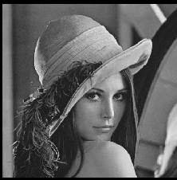
## - Average filter
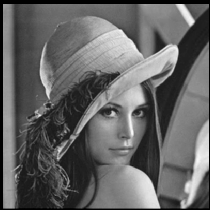
## - Gaussian filter
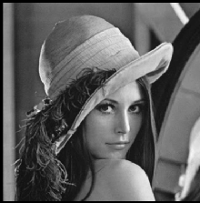
## - Salt & papper pic
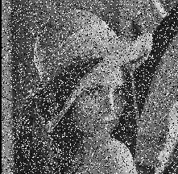
## - median filters
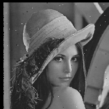

---

# Part 3

## Detect edges in the image using the following masks:
## - Sobel , Roberts , Prewitt and Canny edge detectors
in this section we use function "edgFilters" to manipulate the image with a specific filter we choose and the result is ... 
## - original pic

## - Sobel filter
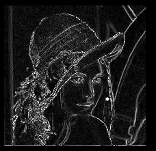
## - Roberts pic
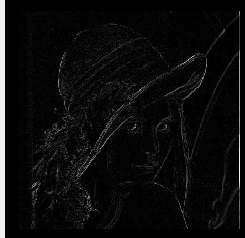
## - Prewitt filters
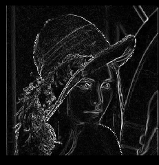

---

# Part 4

## Draw histogram and distribution curve

In this part we've implemented a function called "df" that takes an image data array and return the histogram values for each intensity value.

Using that values to draw a "BarGraphItem" on pyqtgraph we got the following output...

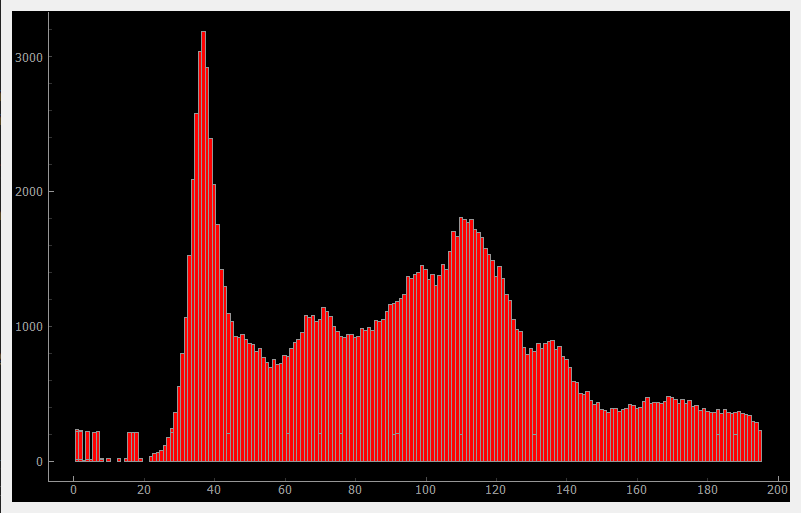

---

# Part 5

## Equalize the image

Your Description goes here...

---

# Part 6

## Normalize the image

Your Description goes here...

---

# Part 7

## Local and global thresholding

Your Description goes here...

---

# Part 8

## Transformation from color image to gray scale image and plot of R, G, and B histograms with its distribution function (cumulative curve that you use it for mapping and histogram equalization)

Your Description goes here...

---

# Part 9

## Frequency domain filters (high pass and low pass)
in this section we use function "freqFilters" to manipulate the image with a LPS or HPS in the frequency domain and get the pic back and the result is ... 
## - original pic

## - low pass filter
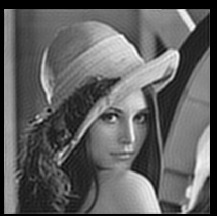
## - Roberts pic
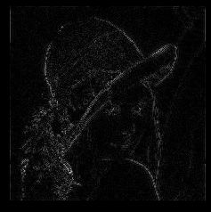

---

# Part 10

## Hybrid images

Your Description goes here...

---