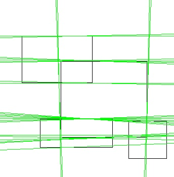
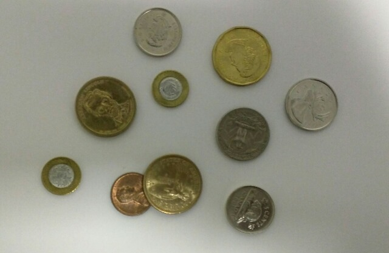

# Computer Vision Course - Group Task #2

---

# Team Work:

| Name | Section | Bench |
| ----------- | ----------- | ----------- |
| Ahmed Adel | 1 | 6 |
| Remon Albear | 1 | 33 |
| Abdulla Zahran | 2 | 4 |
| Mohammed Almotasem | 2 | 19 |

---

# Table of Content

| Requiered Part | Title |
| ----------- | ----------- |
| [#Part 1](#part-1) | Canny Edge Detection |
| [#Part 2](#part-2) | Hough Lines Cetection |
| [#Part 3](#part-3) | Hough Circles Cetection |
| [#Part 4](#part-4) | Active contour|

---

# Part 2 

## Hough Lines Detections
We implement hough algorithm to detect lines in images.
There are some parameters you can change it to adapt to your image like

    1. Number of lines to be detected 
    2. Length of the Lines
    3. Number of Rhos and Thetas
    4. Step of Rhos and thetas
### example 1
here is the input image

We detect the top 25 line with length 200 pixel by using 180 angle and 180 rho 
here is the output

### example 2
here is the input image

We detect the top 50 line with length 200 pixel by using 180 angle and 180 rho 
here is the output

---

# Part 3

## Hough Circles Detections
We implement hough algorithm to detect Cicles in images.
There are some parameters you can change it to adapt to your image like

    1. Minimum Radius
    2. Maximum Radius
    3. Step of Radius
    4. Number of Thetas
    5. Step of Thetas

### example 1
here is the input image

The parameters was minimum radius of 30 and maximum of 200 with step of 1 and 360 angles with step of 1 

here is the output

### example 2
here is the input image

The parameters was minimum radius of 15 and maximum of 200 with step of 1 and 360 angles with step of 1 

here is the output

---

# Part 4

## Active contour

this is the original image that we want to detect the boundaries of it.

Starting with initial guess for the boundary points, then shift the points around until they reach to the local minimum of the energy function.

