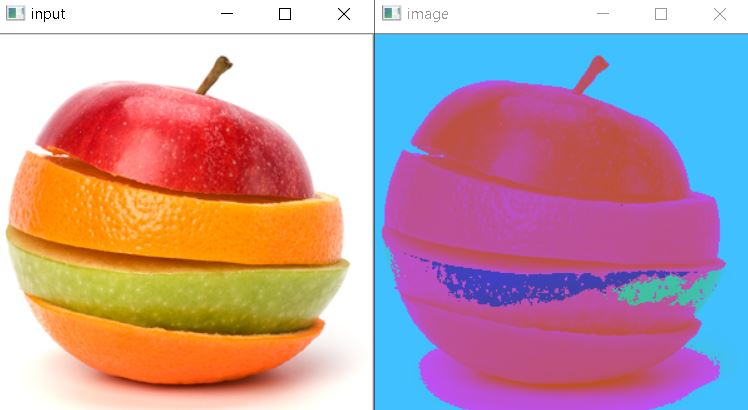
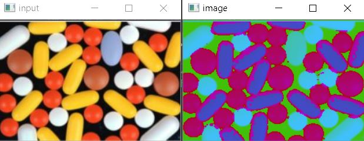
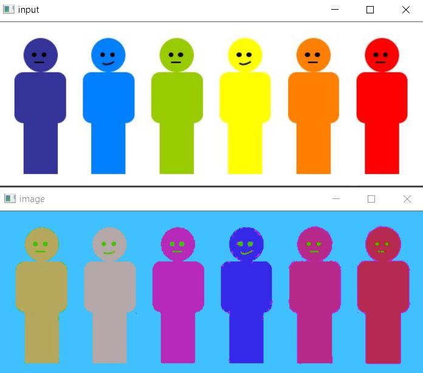

# Computer Vision Course - Group Task #4

---

# Team Work:

| Name | Section | Bench |
| ----------- | ----------- | ----------- |
| Ahmed Adel | 1 | 6 |
| Remon Albear | 1 | 33 |
| Abdulla Zahran | 2 | 4 |
| Mohammed Almotasem | 2 | 19 |

---

# Table of Content

| Requiered Part | Title |
| ----------- | ----------- |
| [#Part 1](#part-1) | Image Thresholding |
| [#Part 2](#part-2) | Image Segmentation |

---

# Part 1

## Image Thresholding

---

# Part 2 

## Image Segmentation

### Mean shift segementation

Results:

* 

* 

* 

